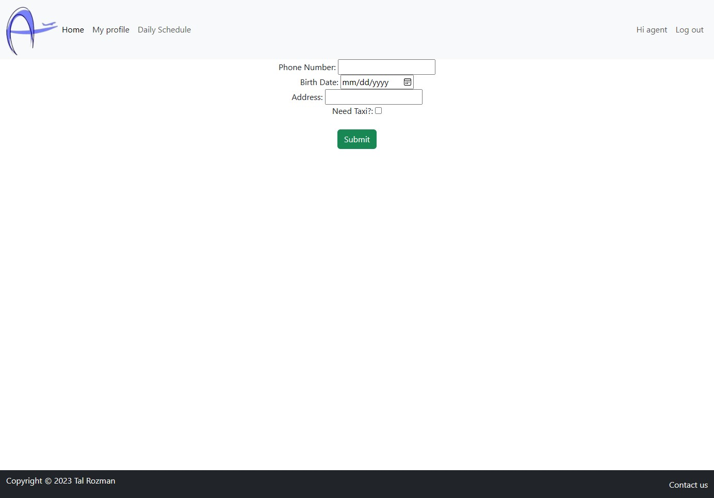

<div align="center">
<a name="readme-top">

    </a>
<br/>
<h1 align='center'>Aerohandling</h1>

<a href='https://aerohandling.netlify.app/'>

</a>
</div>
<br />
<div align="center">
# Aerohandling
> Aerohandling is a small, botique handling company located in TLV Airport, Israel.
> The company requested to create a system to manage employees' daily schedule and tasks.
</div>

# 🧐 Project philosophy

> This project is part of FS python cource. <br/>
> The porpuse of the project is to create a better, easier  and more user friendly 
> daily management system.

>The system is pulling the flights schedule from the web every specified time.
<p align="right">(<a href="#readme-top">back to top</a>)</p>

# 👨‍💻 Tech stack

Here's an overview of the tech stack system uses:<br/>
Front-End - 
- React Redux, TypeScript
- Axios
- MUI
- Bootstrap
- Toastify

Back-End - 
- Language -
    - Python
- Framework -
    - Django
- packages -
    - Selenium
    - BeutifulSoup
- DB - 
    - postgresql
- The server is available as -
    - docker image:
        ```docker
        $ docker pull talrozman/aerohandling:latest
        ```
    - Deployed on Render:
        - https://aerohandling.onrender.com/
<p align="right">(<a href="#readme-top">back to top</a>)</p>

# ✍ Postgresql Tables
 - Users Table
    - Contains the basic information about the employee (name, email, department, role, etc.)
- Departments Table
    - Contains the departments of the company.<br/>Uses as a foreign key
- Employee Type Table
    - Contains the employees types (userGroup) - Manager, Shift supervisor and employee.
    <br/>Uses as a foreign key
- Roles table 
    - Contains the roles in Aerohandling.<br/>Uses as a foreign key
- Profiles Table
    - Contains the employees personal information (phone number, address, transportational information and profile image)
- Flights table
    - Basic Flight information (number, time of departure, destination, etc.)
    - Information relevant for the flight handling (gate, pit, etc.)
    - Employee allocation, using FK to users table.<br/>
    It is possible to allocate only an authorized employye to each title.
    <br/>
    For example, it is imposible to allocate a flight supervisor to be a ramp supervisor.
<p align="right">(<a href="#readme-top">back to top</a>)</p>

# Users abilities annd permissions
## employee -
New employee added to the system gets an email with welcome message.<br/>
<br/>
in addition the mail will contain a link to the system website and temporary password.<br/>
After Login, The employee will be requested to change the password and re-login.<br/>
<br/>
### Available functions - 
- My Profile
    - At first the employee will be required to fill out short form with address, phone number, birth date and transportation way.<br/>
    <br/>
    - After this information is filled in, the employee will be able to see his department, role, and temporary profile picture.<br/>
    Uploading a new profile image is optional.<br/>
    <br/>
- Daily schedule
    - List of all flights per day sorted by schedule departure time.<br/>
    <br/>
    - Filtering options are available for arrivals and departures.<br/>
    <br/>
    - Click on a flight will open detailed information of the flight.<br/>
    <br/>
    - The employee can only view the data.
<p align="right">(<a href="#readme-top">back to top</a>)</p>

## Shift Supervisor -
In addition to all the functionalities of the employee, <br/>
The Shift supervisor is allowed to edit the data in the Daily flight screen
<table>
    <tr>
        <td colspan=2>
            Open detailed information of flight, shift supervisor user. <br/>
            
        </td>
    </tr>
    <tr>
        <td>
            Update Arrival flight information <br/>
            
        </td>
        <td>
            Update Departure flight information <br/>
            
        </td>
    </tr>
</table>
<p align="right">(<a href="#readme-top">back to top</a>)</p>

## Manager - 
In addition to all the functionalities the shift supervisor has, <br/>
The manager have additional manager tools navigation bar.

- Manage Profiles
    - Manage all employees, can disable and enable access to the system.
    - option to filter by department and by employee status (show all employyes or only active employees)
    
- Register new employee
    - only a manager can register new employee to the system.
    - Email, Name, Deparment and role are required.
    - temporary password is sent to employee via invitation email.
    
- Daily Schedule Screen 
    - Only a manger can pull manualy flights to the system.<br/>
    

<p align="right">(<a href="#readme-top">back to top</a>)</p>

# Contact
Tal Rozman - talrozman9@outlook.com<br/>
Project Link: https://github.com/TalRozman/FinalProj_Aerohandling<br/>
Linkdin Link: https://www.linkedin.com/in/tal-rozman/


<p align="right">(<a href="#readme-top">back to top</a>)</p>
